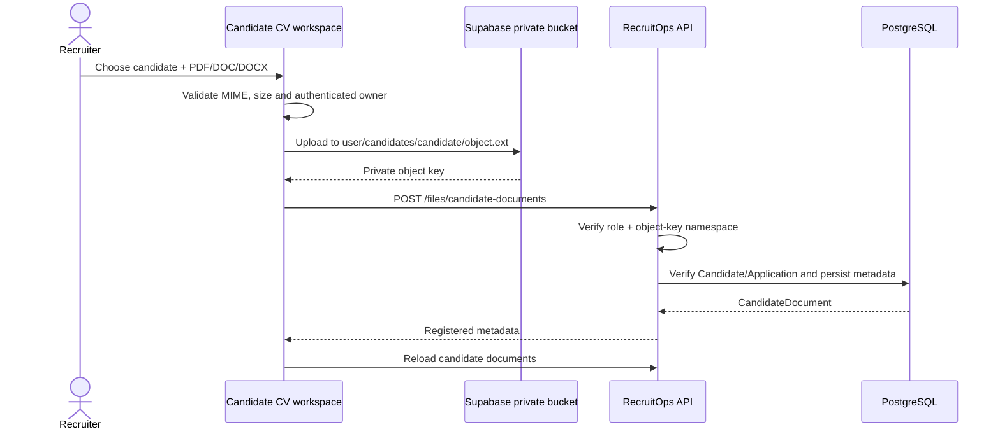

# Candidate CV workspace

The Candidate CV workspace completes the user-facing private candidate-file upload and download flow while preserving the Supabase Storage RLS boundary.

## Upload flow

## Validation

The browser uses the shared private-file contract and storage adapter. CV uploads allow PDF, DOC and DOCX with a 10 MB maximum. Storage uses `upsert=false`; metadata registration occurs only after the private object upload succeeds.

The API remains authoritative for candidate-document metadata access and storage-key ownership. `VIEWER` cannot list or register candidate documents.

## Download authorization

Downloads use a short-lived signed URL with a maximum client-requested TTL of 15 minutes; the Candidate CV workspace currently requests 5 minutes.

The storage helper resolves the authenticated user through `supabase.auth.getUser()` before requesting a signed URL. Authorization then mirrors the installed Supabase Storage RLS model:

- `RECRUITER` may create a signed URL only for objects under their own authenticated user prefix;
- `OWNER` and `ADMIN` may create signed URLs across user prefixes because their trusted `app_metadata.recruitops_role` is explicitly allowed by the private-bucket RLS policy;
- `VIEWER`, missing roles and unknown roles do not receive administrative cross-prefix capability;
- browser-editable `user_metadata` is never used for authorization.

The UI exposes the download action for the original uploader and for `OWNER`/`ADMIN`. Other recruiters may see authorized metadata but do not receive a cross-prefix download action.

No service-role credential is required for the ordinary download path, and the bucket remains private.

## Security tests

The private-storage adapter tests cover:

- own-prefix recruiter upload/download;
- recruiter denial for another user's prefix;
- `OWNER` and `ADMIN` cross-prefix download authorization;
- fail-closed behavior for unknown roles.

Supabase RLS remains the final storage authorization layer, so application checks are defense in depth rather than a replacement for bucket policies.
