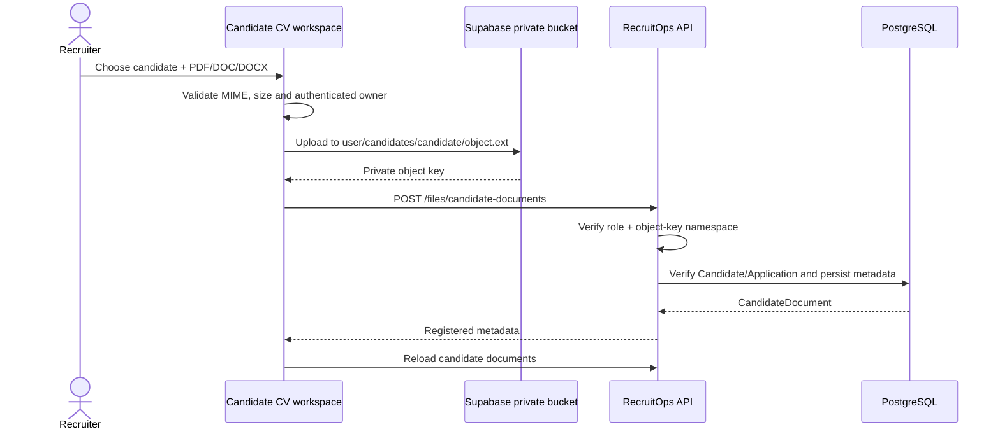

# Candidate CV workspace

The Candidate CV workspace completes the user-facing **upload** side of the private candidate-file flow while preserving the current security boundary for downloads.

## Upload flow

## Validation

The browser uses the shared private-file contract and storage adapter. CV uploads allow PDF, DOC and DOCX with a 10 MB maximum. Storage uses `upsert=false`; metadata registration occurs only after the private object upload succeeds.

The API remains authoritative for candidate-document access and storage-key ownership. `VIEWER` cannot list or register candidate documents.

## Download boundary

The current browser storage helper may create a short-lived signed URL only when the object key belongs to the currently authenticated uploader. That makes the own-upload download button safe with the existing RLS namespace.

A document uploaded by another recruiter is listed through the authorized RecruitOps API but **does not expose a browser download action**. Cross-recruiter download requires a future server-authorized signed URL endpoint so RecruitOps can apply RBAC/audit rules without weakening storage RLS.

Therefore the Master Plan items for complete private CV storage and complete upload/download flow remain open until that server-mediated cross-recruiter path is implemented and tested.
