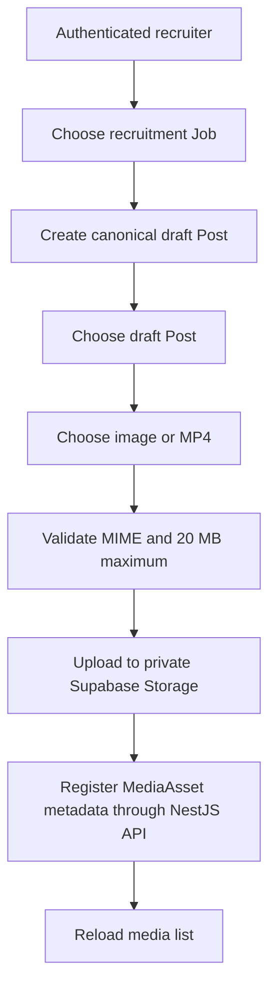

# Content and media workspace

The Content Studio now exposes the user-facing path required to create a canonical draft Post and attach private social media assets.

## Flow

## Authorization

- `OWNER`, `ADMIN`, and `RECRUITER` may create drafts and upload/register content media.
- `VIEWER` may read Posts and media metadata but cannot mutate either.
- The browser generates storage keys through the shared private-file contract; it never accepts an arbitrary object key from the user.
- Supabase Storage RLS remains the final object-storage authorization layer.

## File policy

The current UI accepts JPEG, PNG, WebP, and MP4 files with a 20 MB maximum. This is an application policy chosen to stay comfortably within the current free-tier operational model; individual social adapters will later apply stricter platform-specific constraints before publication.
